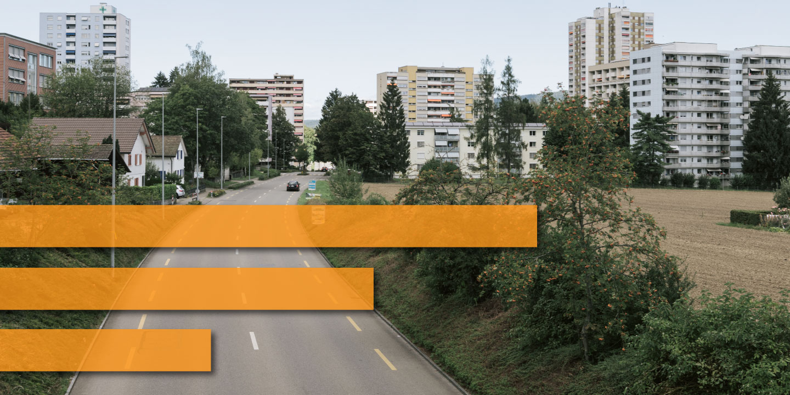

# Abstimmungsfaktor Agglomerationen

### Analyse der Abstimmungen seit 1981

Die Untersuchung basiert auf den Abstimmungsdaten auf Gemeindeebene und auf der Gemeindetypologie 2012. Beide Datensätze sind vom Bundesamt für Statistik zur Verfügung gestellt und beziehen sich auf den Gemeindestand von 2020. Genutzt werden die Daten zu allen Abstimmung ab dem 14. Juni 1981.

Die Einteilung der Gemeinden zu den drei Siedlungstypen beruht auf einem engen Begriff der Agglomeration: Als Agglomerationen gelten «Städtische Arbeitsplatzgemeinden» und «Städtische Wohngemeinden» von grossen und mittelgrossen Agglomerationen. Die jeweiligen Kernstädte sind als Stadt gekennzeichnet, die restlichen Gemeinden als Land. Durch die Auswahl von grossen und mittelgrossen Agglomerationen soll der Fokus auf charakteristische Städte und deren Agglomerationsgürtel gelegt werden.

Die Berechnung der jeweiligen Abstimmungsresultate stützt sich auf die gesammelten Ja- und Nein-Stimmen pro Region. So kann ermittelt werden, ob Regionen als Ganzes zu einer Vorlage Ja oder Nein gestimmt hätten.

## **Artikel**:
- [Die Agglomerationen gewinnen 97 Prozent aller Abstimmungen](https://www.tagesanzeiger.ch)

## **Datenquelle(n)**: 
- [Abstimmungsdaten auf Gemeinde Ebene (Bundesamt für Statistik)](https://www.bfs.admin.ch/bfs/de/home/statistiken/politik/abstimmungen.assetdetail.14007758.html)
- [Gemeindetypologie 2012 (Bundesamt für Statistik)](https://www.atlas.bfs.admin.ch/maps/13/de/12359_12482_3191_227/20387.html)

## **Notebook**:
- [Inkl. interaktiver Charts](https://interaktiv.tagesanzeiger.ch/datenteam/abstimmungsfaktor_agglomerationen.html)
- [Github](https://github.com/tamedia-ddj/abstimmungsfaktor_agglomerationen/blob/master/abstimmungsfaktor_agglomerationen.ipynb)

## Output:
### output/municipality\_map.csv

Gemeindezuordnung zu Siedlungstype (Gemeindestand 2020)

Variable | Beschreibunng
--- | --- 
`Code ` | BFS-Nr.
`Gemeindename ` | Bezeichnung der Gemeinde
`Kanton` | Kanton der Gemeinde
`municipality_type` | Siedlungstyp

### output/waehleranteile.csv

Durchschnittliche Wähleranteile pro Jahr seit 1981 pro Siedlungstyp

Variable | Beschreibunng
--- | --- 
`Jahr ` | Jahr
`Anteil_Agglo ` | Durchschnittlicher Wähleranteil der Agglomeration für das jeweilige Jahr
`Anteil_Stadt` | Durchschnittlicher Wähleranteil der Stadt für das jeweilige Jahr
`Anteil_Land` | Durchschnittlicher Wähleranteil das Land für das jeweilige Jahr

### output/allianzen.xlsx

Übersicht der umstrittenen Vorlagen und jeweiliger Ja-Stimmen-Anteil pro Siedlungstyp

Variable | Beschreibunng
--- | --- 
`Vorlage ` | Offizielle Bezeichung der Vorlage
`pct_agglo ` | Ja-Stimmen-Anteil der Agglomeration
`pct_city` | Ja-Stimmen-Anteil der Stadt
`pct_rural` | Ja-Stimmen-Anteil des Landes
`pct_ch` | Nationaler Ja-Stimmen-Anteil
`Datum` | Datum an dem über die Vorlage abgestimmt wurde
`alliance` | Mit wem ist die Agglomeration eine "Allianz" eingegangen? Entweder `city` oder `rural`

## Lizenz

*Abstimmungsfaktor Agglomerationen* is free and open source software released under the permissive MIT License.

